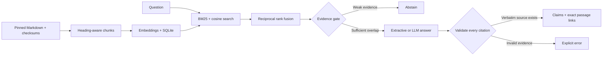

# DocCite

**Ask the docs. Inspect the evidence. Measure when the answer should be “I don’t know.”**

A documentation assistant for [HTTPX](https://github.com/encode/httpx) that combines
document ingestion, embeddings, hybrid search, optional LLM generation, and exact
source citations. Built as an AI engineering portfolio project with inspectable
components and reproducible evaluations.

Every accepted claim has a verbatim source passage. Citation links point to
specific lines at an immutable Git commit. Questions the selected documentation
cannot establish are evaluated separately from ordinary factual questions.

## Run it in one minute

Requires Python 3.11+. Run these commands from this directory.

```bash
python3 -m venv .venv
source .venv/bin/activate
python -m pip install -e .
doccite ingest
doccite ask "What is the default timeout for network inactivity?"
doccite ask "What uptime SLA does HTTPX guarantee?"
```

On Windows, activate with `.venv\Scripts\activate`. No API key, database service,
model download, or network access is needed after installing the base package.
For a completely dependency-free run, use `PYTHONPATH=src python3 -m doccite`
instead of `doccite` on macOS/Linux.

The first question returns a cited excerpt. The second abstains. Add `--json`
to inspect the full response, evidence score, source hashes, and retrieval trace.

**The default is an extractive baseline:** deterministic feature-hash vectors and
verbatim excerpts. It is useful for inspecting the pipeline, but is not neural
semantic search or LLM synthesis. Both are available explicitly below.

## What this demonstrates

| Engineering area | Implementation |
|---|---|
| Data ingestion | Manifest-driven Markdown ingestion, SHA-256 verification, pinned source revision |
| Chunking | Heading-aware passages, preserved code fences, original line offsets |
| Embeddings | Reproducible feature-hashing baseline; optional pinned MiniLM neural model |
| Search | BM25, cosine similarity, reciprocal rank fusion, component-level traces |
| RAG | Retrieved context → evidence gate → structured generation → citation validation |
| Citations | Claim-to-evidence mapping, exact quotes, immutable GitHub line permalinks |
| Abstention | Configurable evidence gate, model-level abstention, explicit failure states |
| Evaluation | Labeled development/test sets, retrieval and citation metrics, false-answer rate |
| Delivery | Python package, CLI, FastAPI, automated tests, GitHub Actions |



## Neural embeddings and generated answers

Neural retrieval runs locally on the CPU. The first run downloads the pinned
`sentence-transformers/all-MiniLM-L6-v2` model; subsequent runs can use the cache.

```bash
python -m pip install -e ".[semantic]"
doccite ingest --embeddings semantic --index .doccite/semantic.sqlite
doccite ask "What are the four types of timeouts?" --index .doccite/semantic.sqlite
```

For full RAG with LLM synthesis, choose a Responses API model that supports
Structured Outputs and set its exact ID. Model choice is explicit; no paid
provider is silently enabled.

```bash
export OPENAI_API_KEY="your-key"
export DOCCITE_MODEL="your-structured-output-model-id"
doccite ask "What are the four types of timeouts?" \
  --index .doccite/semantic.sqlite --generator openai --json
```

The optional integration uses the [OpenAI Responses API’s structured output
format](https://developers.openai.com/api/docs/guides/structured-outputs).
It sends the question and eligible source passages to OpenAI with `store=false`.
An `.env.example` documents configuration; environment files are not loaded
automatically. Keep real credentials outside Git.

Provider failures and invalid citations are errors, never successful abstentions.
The API integration has mocked contract tests; no live paid generation results
are claimed in the included baseline report.

## Inspect the search

```bash
doccite info
doccite search "What are the four types of timeouts?" --mode hybrid
doccite search "What are the four types of timeouts?" --mode bm25
doccite search "What are the four types of timeouts?" --mode dense
```

Each hit exposes its passage, exact URL, BM25 score, cosine similarity, reciprocal
rank fusion score, and IDF-weighted query coverage. The evidence score is a
heuristic overlap measure, **not a calibrated probability of correctness**.

## Measured baseline

The included [test report](reports/baseline-test.md) contains an actual run on
32 hand-authored questions: 16 answerable and 16 unanswerable. Configuration:
feature-hash embeddings, hybrid search, extractive answers, `k=5`, threshold `0.62`.

| Metric | Result |
|---|---:|
| Gold passage retrieved in top 5 | 16 / 16 |
| Answerable questions answered | 12 / 16 |
| Unanswerable questions correctly abstained | 16 / 16 |
| False answers on unanswerable questions | 0 / 16 |
| Answers quoting labeled gold evidence | 11 / 12 |
| Exact citation validity | 12 / 12 |

The distinction matters: all gold passages were retrieved, but the conservative
gate withheld four answerable questions. One accepted excerpt missed the labeled
answer evidence even though its citation was authentic. This is a small authored
benchmark, not evidence of production reliability or a universal hallucination rate.

```bash
doccite evaluate --output reports/my-run.json
python scripts/compare.py
# Compare neural retrieval without changing the labeled test set:
doccite evaluate --index .doccite/semantic.sqlite --output reports/my-neural-run.json
```

JSON reports include per-question answers, citations, configuration, corpus and
dataset fingerprints, errors, and timing. Markdown reports summarize them.
The development comparison sweeps search modes and thresholds on `dev.jsonl`
only. [Evaluation notes](docs/evaluation.md) define the metrics and limitations.

The [measured neural run](reports/neural-test.md) also retrieved all 16 gold
passages and answered 12 questions, but only 10 answers included the annotated
gold quote. Adding neural embeddings alone did not improve this benchmark.
Both runs use the same extractive answer selector and lexical evidence gate;
neither report measures LLM generation.

## Local API

```bash
python -m pip install -e ".[api]"
doccite ingest
uvicorn doccite.api:app --host 127.0.0.1 --port 8000
```

Open **http://127.0.0.1:8000/docs** for the interactive API explorer.

```bash
curl http://127.0.0.1:8000/ask \
  -H 'Content-Type: application/json' \
  -d '{"question":"What is the default timeout for network inactivity?"}'
```

`GET /health` shows the loaded index. `POST /ask` returns the same structured
answer as the CLI. Set `DOCCITE_INDEX`, `DOCCITE_GENERATOR`, and the provider
variables before starting the server to change its backend. Restart after
rebuilding the index: each process serves a single immutable in-memory snapshot.

This is a local demonstration server with bounded input and one concurrent
generation per process. Public hosting would require authentication, rate limits,
quotas, and an operational deployment design.

## Test and reproduce

```bash
python -m pip install -e ".[api,dev]" -c constraints-ci.txt
pytest -q
ruff check src tests scripts
ruff format --check src tests scripts
```

The GitHub Actions workflow runs these checks, evaluates the offline baseline
with quality gates, and uploads the evaluation artifacts. The bundled corpus
is checksum-verified during ingestion; formatting tools exclude upstream files.

## Project map

```text
src/doccite/
  ingest.py        # Verified source ingestion and exact-line chunking
  embeddings.py    # Hashing and pinned sentence-transformer backends
  search.py        # SQLite snapshots, BM25, cosine search, rank fusion
  answer.py        # Evidence gate, providers, citation validation
  evaluate.py      # Passage-level and abstention metrics
  cli.py / api.py  # User interfaces
  corpus/httpx/    # Licensed, immutable documentation snapshot
benchmarks/        # Annotated development and test questions
reports/           # Measured outputs, including unsuccessful cases
tests/             # Source integrity, retrieval, citations, provider/API failures
docs/              # Architecture decisions, evaluation notes, portfolio demo
```

## Adapt or publish

To use another GitHub-hosted library, create a corpus directory with its Markdown
files and a manifest following [the bundled example](src/doccite/corpus/httpx/manifest.json).
Record a full commit SHA, the license, each source URL, and each file’s SHA-256.
Then run `doccite ingest --corpus path/to/corpus --index .doccite/other.sqlite`.
Author a new evaluation set for that corpus and use `--dataset` to select it.
The restore script is intentionally specific to HTTPX.

This folder is self-contained and can be the root of a new GitHub repository.
[Portfolio and publishing guide](docs/portfolio.md) includes a short demo script,
honest resume language, and publishing commands.

Project code: [MIT](LICENSE). Bundled HTTPX docs: [BSD-3-Clause](THIRD_PARTY_NOTICES.md).
